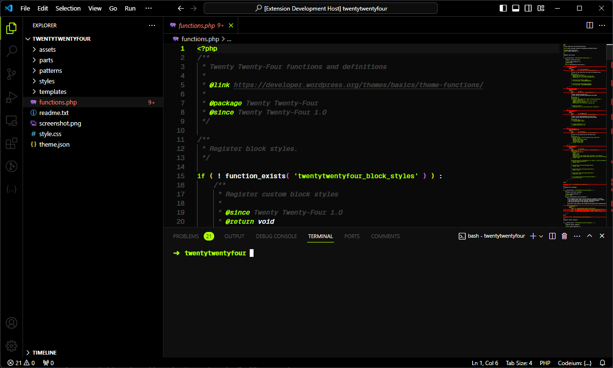

# Slime

My first color theme made for [Visual Studio Code](https://code.visualstudio.com/). The name was chosen to represent a Tibia creature called [Slime]([https://www.tibia.com/community/?subtopic=creatures&name=Slime](https://www.tibia.com/library/?subtopic=creatures&race=slime)).

# Screenshot

[Install on Marketplace](https://marketplace.visualstudio.com/items?itemName=luanpiegas.slime-color-theme)

**Enjoy!**
